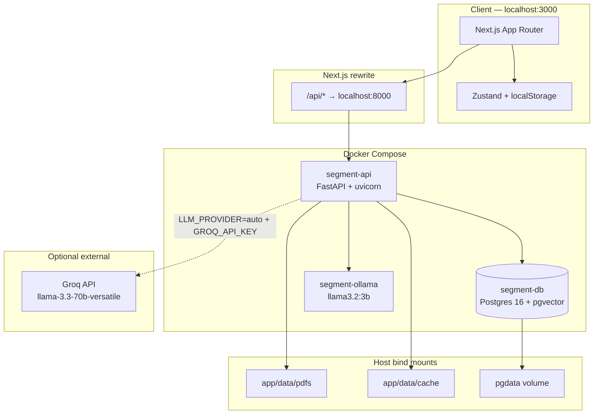
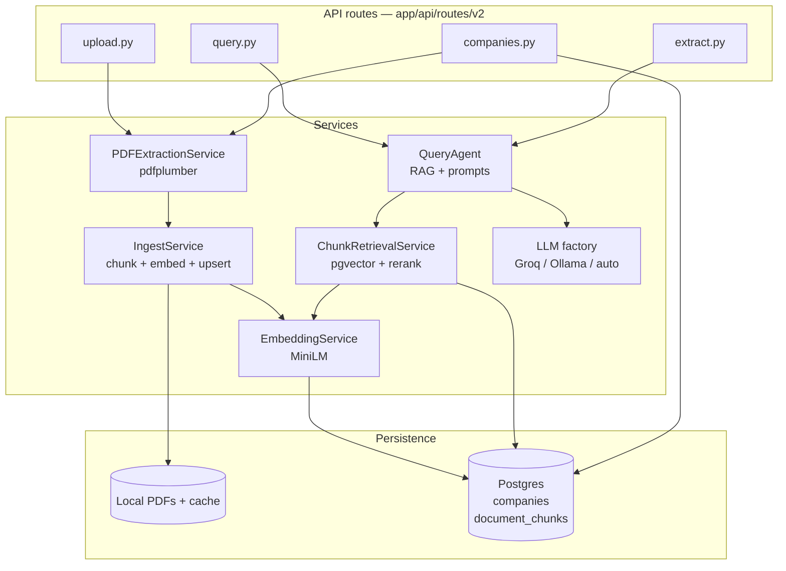
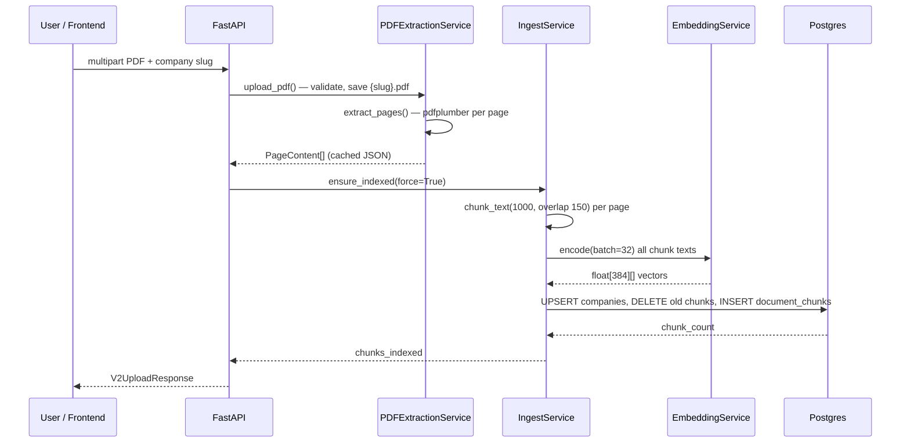
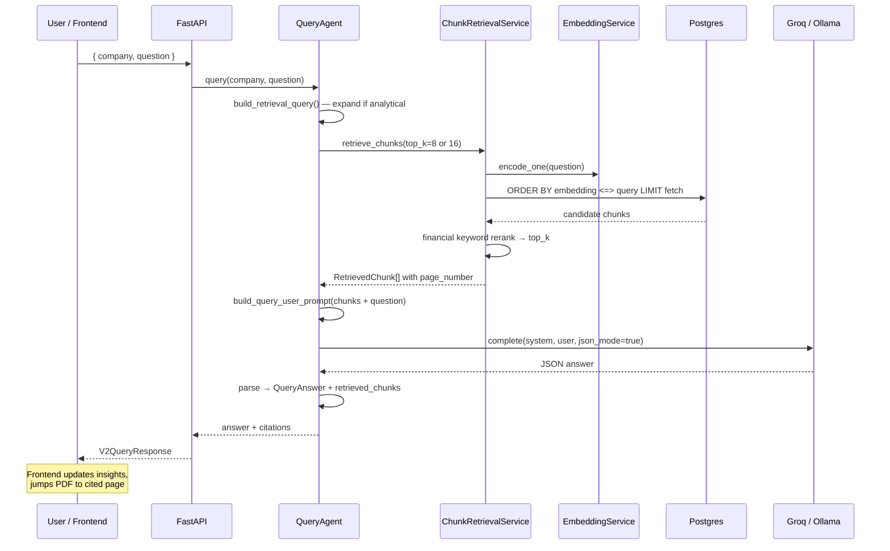
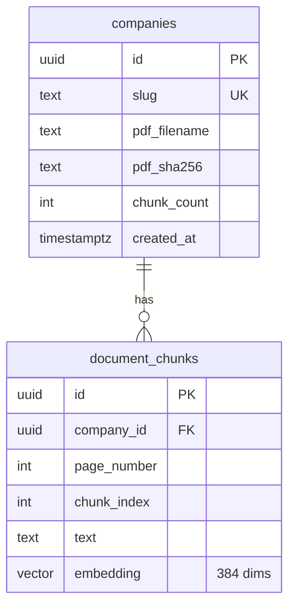
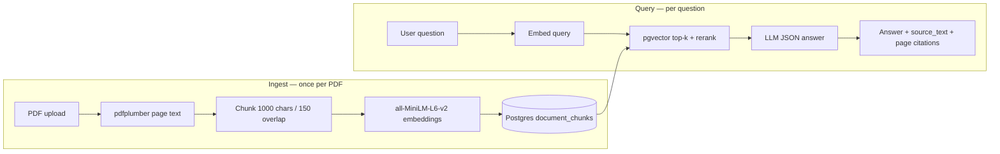
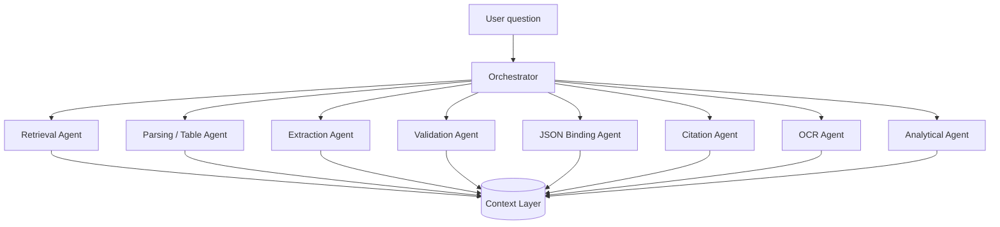

# 10-K Financial Report Extraction & Evaluation

A local pipeline that extracts financial metrics from SEC 10-K PDFs, evaluates accuracy against ground truth, and documents where the approach breaks down. Built as a Forward Deployed Engineer–style interview project.

## Goal

Extract three challenging but consistently available fields from 10-K reports:

| Field | Examples |
|-------|----------|
| **Geographic revenue** | Americas, North America, International |
| **Segment revenue** | AWS, Digital Media, iPhone, Data Center |
| **R&D expense** | Research and development, Technology and development |

Demonstrate: extraction → evaluation → error analysis → iterative improvement (V1 vs V2).

## Constraints

- **No** OCR APIs, Unstructured.io paid APIs, or external document services
- **Only** local processing: FastAPI, pdfplumber, sentence-transformers, Postgres/pgvector, regex

---

## How to run

Start here to get the stack running before reading the architecture sections below.

### Docker (recommended)

```bash
docker compose up --build
```

| Service | URL |
|---------|-----|
| **App (frontend)** | http://localhost:3000 |
| API docs | http://localhost:8000/docs |
| Health | http://localhost:8000/health |
| Postgres | `localhost:5432` (user/pass/db: `segment`) |
| Ollama | `localhost:11434` |

```bash
# One-time: pull Ollama model (if not using Groq)
docker exec segment-ollama ollama pull llama3.2:3b

# Copy env and set GROQ_API_KEY (optional, faster LLM)
cp backend/.env.example backend/.env

# Rebuild API after backend code changes
docker compose build api && docker compose up -d api

# Stop / reset DB + embeddings
docker compose down
docker compose down -v   # wipes Postgres volume
```

First build downloads PyTorch + `all-MiniLM-L6-v2` (~few minutes).

**Typical flow:** `docker compose up` → `cd frontend && npm install && npm run dev` → open http://localhost:3000 → upload a PDF → use `/agent` to chat.

### Frontend

```bash
cd frontend
npm install
npm run dev
```

Open http://localhost:3000. The app proxies `/api/*` to `http://localhost:8000`.

### Backend (local, without Docker)

```bash
cd backend
cp .env.example .env
python -m venv venv && source venv/bin/activate
pip install -r requirements.txt -r requirements-docker.txt
python app.py
```

Semantic retrieval needs Postgres with pgvector — run at least `docker compose up db` (or the full Compose stack) alongside local API.

### Batch extraction & accuracy (CLI, V1)

```bash
cd backend
python scripts/batch_extract_v1.py --pdf-dir ../data
python scripts/build_accuracy_report.py
```

Output: `backend/app/data/extracted/v1/accuracy_report.json`

### Quick API smoke test (V2)

```bash
curl -X POST http://localhost:8000/api/v2/upload \
  -F "file=@data/alphabet-10k.pdf" \
  -F "company=alphabet" \
  -F "overwrite=true"

curl -X POST http://localhost:8000/api/v2/query \
  -H "Content-Type: application/json" \
  -d '{"company":"alphabet","question":"What were total Revenues for FY2023 in millions?"}'
```

---

## API (versioned)

| Version | Path | Status |
|---------|------|--------|
| **V1** | `POST /api/v1/upload` | Keyword/regex extraction |
| **V2** | `POST /api/v2/upload` | Embed entire PDF |
| **V2** | `POST /api/v2/query` | Ask any question — direct answer |
| **V2** | `POST /api/v2/extract` | Optional: 3 assignment fields (eval) |
| **V2** | `GET /api/v2/companies/{company}/pdf` | Serve stored PDF (inline) |
| **V2** | `GET /api/v2/companies/{company}/info` | PDF + index metadata |

**LLM:** Groq when `GROQ_API_KEY` is set in `backend/.env`; otherwise **Ollama** (`ollama` service in Docker). `auto` mode tries Groq first, then falls back to Ollama.

```
app/api/routes/
  v1/upload.py
  v2/upload.py | query.py | extract.py | companies.py
```

### Environment (`backend/`)

| File | Purpose |
|------|---------|
| `.env` | Primary config + secrets (`GROQ_API_KEY`) — **gitignored** |
| `.env.local` | Optional machine-specific overrides — **gitignored** |
| `.env.example` | Committed template (copy to `.env`) |

---

## What we built

### Backend (`backend/`)

**V1 pipeline** (via upload):

```
PDF upload → page text (pdfplumber) → retrieval → regex/table parsing → results.json
```

**V2 pipeline:**

```
POST /api/v2/upload   → embed full PDF
POST /api/v2/query    → your question → answer (value + source_text)
POST /api/v2/extract  → optional: geo + segment + R&D for assignment eval
```

**Scripts** (not HTTP):

- `scripts/batch_extract_v1.py` — batch all PDFs → `data/extracted/v1/{company}_results.json`
- `scripts/build_accuracy_report.py` — compare extraction vs PDF truth → `accuracy_report.json`

### Frontend (`frontend/`)

Next.js app with three pages wired to the backend:

| Page | Purpose |
|------|---------|
| `/` | Upload 10-K PDFs → `POST /api/v2/upload` |
| `/agent` | PDF viewer, RAG chat (`/api/v2/query`), live metrics sidebar |
| `/compare` | V1 vs V2 accuracy charts (Alphabet showcase JSON) |

The frontend proxies `/api/*` to `localhost:8000` via Next.js rewrites.

### Data layout

```
data/                          # Source PDFs (local, not in git)
backend/app/data/
  pdfs/                        # Uploaded PDFs
  cache/                       # Cached page text (JSON)
  extracted/
    results.json               # Latest API upload results
    v1/                        # Batch script output + accuracy report
  ground_truth/
    ground_truth.csv           # Manual answer key (Adobe complete)
```

Postgres (Docker): `companies`, `document_chunks` (embeddings).

---

## V1 results (batch script, keyword retrieval)

Source: `backend/app/data/extracted/v1/accuracy_report.json` (9 companies, 25 fields, 1% tolerance)

| Metric | Score |
|--------|-------|
| **First-pick accuracy** | **16%** (4/25) |
| **Any-match accuracy** | **64%** (16/25) |

V1 fails mainly on **value selection** (right page, wrong first number). V2 targets better retrieval + label-aware LLM parsing.

---

## V2: Semantic RAG Pipeline

V2 replaces keyword page matching with **embed the whole filing → retrieve relevant chunks → LLM extracts the answer with citations**. It is the production path used by the `/agent` UI and the evaluation harness.

> Package-specific docs: [`backend/README.md`](backend/README.md) · [`frontend/README.md`](frontend/README.md)

### System architecture

Full-stack V2 runs as four processes (three in Docker Compose, one optional external):



| Layer | Technology | Responsibility |
|-------|------------|----------------|
| **Frontend** | Next.js 16, React 19, Zustand | Upload UI, PDF viewer (blob iframe), RAG chat, insights |
| **API gateway** | Next.js rewrites | Same-origin `/api/*` proxy to backend |
| **Application** | FastAPI | Versioned REST: upload, query, extract, PDF serve |
| **Embeddings** | sentence-transformers `all-MiniLM-L6-v2` | 384-dim vectors, CPU, baked into Docker image |
| **Vector store** | Postgres + pgvector | Per-company chunk index, cosine search |
| **LLM** | Groq and/or Ollama | JSON-structured answers from retrieved context |
| **File store** | Local filesystem | PDFs + page-text JSON cache (not S3) |

### Backend component architecture



**Dependency wiring** (`app/utils/dependencies.py`): singleton services injected into route handlers — `V2IngestService`, `QueryAgent`, `ChunkRetrievalService`, `PDFExtractionService`.

### Ingest flow (upload)

Triggered by `POST /api/v2/upload` or the dashboard upload zone.



**Idempotency:** If the same PDF bytes are re-uploaded (matching `pdf_sha256`) and `force` is not set, ingest can skip re-embedding. Current upload path uses `force=True` after every upload to refresh the index.

### Query flow (RAG chat)

Triggered by `POST /api/v2/query` or the `/agent` chat panel.



**Analytical questions** (`best`, `highest`, `which month`, etc.): retrieval query is expanded with period/sales terms, `top_k` doubles to 16, and prompts allow comparing numbers across chunks to find max/min.

### Data model



Frontend state (not in Postgres): chat messages, live metrics per slug, PDF page position — held in Zustand; only `documents` + `selectedDocId` persist to `localStorage`.

### Why V1 was not enough

| V1 limitation | What breaks in practice |
|---------------|-------------------------|
| Flattened PDF text | Table columns (2022 vs 2023) collapse into one stream |
| Regex / first-number heuristics | Picks the wrong cell on the right page |
| Keyword retrieval | Misses semantically related passages ("Technology and development" vs "R&D") |
| No reasoning layer | Cannot answer ad-hoc questions like total revenue or net income |

V2 keeps **local-only** constraints: no paid OCR APIs, no external document services. Everything runs in Docker on your machine.

### Why Docker

We run the full stack in Docker because V2 depends on **three cooperating services** that are painful to install and wire by hand on every machine:

| Service | Container | Role |
|---------|-----------|------|
| **Postgres + pgvector** | `segment-db` | Stores 384-dim embeddings and runs cosine similarity search |
| **Ollama** | `segment-ollama` | Local LLM fallback when Groq is unavailable |
| **FastAPI API** | `segment-api` | PDF ingest, embedding, retrieval, query agent |

**Design reasons for Docker:**

1. **pgvector extension** — Vector search requires Postgres with the `vector` extension. The `pgvector/pgvector:pg16` image gives a known-good setup without manual extension compilation.
2. **Reproducible environment** — PyTorch CPU + `sentence-transformers` + pdfplumber are baked into the API image. First build is slow; every run after that is consistent.
3. **Service discovery** — The API connects to `db:5432` and `ollama:11434` on the Compose network. No host-specific URL juggling.
4. **Persistent data** — PDFs, page-text cache, and Postgres volume survive container restarts. Re-uploading the same unchanged PDF skips re-embedding (SHA-256 check).
5. **Optional Groq, guaranteed local fallback** — Set `GROQ_API_KEY` in `backend/.env` for fast cloud inference; Ollama stays available if Groq fails or is unset.

Only PDFs and extracted artifacts are bind-mounted from the host (`backend/app/data/pdfs`, etc.). Application code is baked into the image — rebuild with `docker compose build api` after backend changes.

### End-to-end flow



**Upload (`POST /api/v2/upload`):**

1. Save PDF to `backend/app/data/pdfs/{slug}.pdf`
2. Extract page text with **pdfplumber** (cached as JSON under `cache/`)
3. Split each page into overlapping chunks (`chunk_size=1000`, `overlap=150`)
4. Embed all chunks with **`all-MiniLM-L6-v2`** (384 dimensions, runs locally)
5. Upsert into `companies` + `document_chunks` in Postgres

**Query (`POST /api/v2/query`):**

1. Build retrieval query: `{question} {company name}` (company name helps disambiguate multi-filing corpora)
2. Embed the query with the same model
3. Retrieve top candidates from pgvector, rerank, pass top **8** chunks to the LLM
4. LLM returns strict JSON: `answer`, `label`, `value`, `unit`, `fiscal_year`, `source_text`
5. Response includes `retrieved_chunks` (page number, score, snippet) for UI citations and PDF page jumps

**Extract (`POST /api/v2/extract`):** Same retrieval stack, but a fixed prompt for the three assignment fields (geo revenue, segment revenue, R&D) — used for evaluation, not general chat.

### Retrieval design decisions

#### 1. Page-level chunking, not whole-document embedding

**Decision:** Chunk per page after pdfplumber extraction, with sliding windows inside long pages.

**Why:** 10-K filings are 80–120 pages. A single vector for the whole document dilutes signal. Page boundaries also preserve `page_number` for citations and PDF viewer jumps.

#### 2. `all-MiniLM-L6-v2` (384-dim)

**Decision:** Small, fast sentence-transformers model baked into the Docker image.

**Why:** Runs on CPU without GPU, good enough for financial passage retrieval, and matches pgvector column dimension. Heavier models (e.g. `bge-large`) would improve recall but slow ingest and query on a laptop-first setup.

#### 3. pgvector cosine search (`<=>` operator)

**Decision:** Store embeddings in Postgres; query with `ORDER BY embedding <=> query_vector LIMIT N`.

**Why:** Keeps vectors co-located with company metadata. No separate vector DB to operate. Cosine distance on normalized embeddings is standard for semantic search.

#### 4. Over-fetch + financial re-ranking

**Decision:** Fetch `top_k × 3` (cap 30) from pgvector, then rerank before returning `top_k=8`.

**Why:** Pure embedding similarity sometimes ranks narrative MD&A above consolidated financial tables. The reranker boosts chunks containing markers like `$`, `million`, `consolidated`, `research and development`, year patterns, and dollar amounts:

```python
# Simplified from app/services/retrieval/chunks.py
boost += 0.08 if re.search(r"\$[\d,]+", text) else 0
boost += 0.015 per financial keyword match
```

This is a cheap, interpretable fix — no cross-encoder model, no extra latency.

#### 5. Idempotent ingest via PDF hash

**Decision:** Store `pdf_sha256` on the `companies` row; skip re-embedding if the file unchanged.

**Why:** Re-uploading the same 10-K during development should not wipe and rebuild hundreds of chunks every time.

### LLM agent design decisions

#### 1. Retrieval-augmented generation (RAG), not fine-tuning

**Decision:** The LLM never sees the full 10-K — only the top retrieved chunks.

**Why:** Fits the assignment constraint (local pipeline, no training data). Grounds answers in `source_text` for evaluation and UI citations.

#### 2. Strict JSON output schema

**Decision:** System prompts require JSON only (`answer`, `label`, `value`, `unit`, `fiscal_year`, `source_text`).

**Why:** Enables automated accuracy checks (numeric tolerance), structured frontend rendering, and the `/compare` charts. Rules in the prompt explicitly address multi-column tables and fiscal-year selection — the main failure mode in V1.

#### 3. Groq primary, Ollama fallback (`auto`)

**Decision:** `LLM_PROVIDER=auto` tries Groq (`llama-3.3-70b-versatile`) when `GROQ_API_KEY` is set; on failure, falls back to Ollama (`llama3.2:3b`).

**Why:** Groq is fast and strong on table reasoning for demos; Ollama keeps the stack fully offline. The health endpoint reports which provider is active.

#### 4. Separate `/query` vs `/extract` endpoints

**Decision:** General questions use `/query`; the three assignment metrics use `/extract` with a dedicated prompt and retrieval query seed.

**Why:** Evaluation needs stable field definitions. Chat needs flexibility ("What was net income?", "US revenue?", etc.) without hard-coding every metric.

### V2 evaluation (Alphabet FY2023)

Source: `backend/app/data/evaluation/v2_alphabet_showcase.json`

| Metric | V1 baseline | V2 (Alphabet) |
|--------|-------------|---------------|
| Targeted query accuracy | ~20% on same 5 checks | **100%** (5/5) |
| Assignment fields (geo, segment, R&D) | Partial / wrong column | **3/3 correct** |

Example ground-truth checks that V2 passes:

| Question | Expected (millions) |
|----------|---------------------|
| Total revenues FY2023 | 307,394 |
| R&D expense FY2023 | 45,427 |
| Google Services segment | 272,543 |
| US geographic revenue | 146,286 |
| Net income FY2023 | 73,795 |

Tolerance: 1% relative error. V2 succeeds because retrieval surfaces the consolidated income statement and segment note tables, and the LLM prompt enforces picking the correct fiscal-year column.

### V2 API quick reference

```bash
# Upload + embed
curl -X POST http://localhost:8000/api/v2/upload \
  -F "file=@data/alphabet-10k.pdf" \
  -F "company=alphabet" \
  -F "overwrite=true"

# Ask anything
curl -X POST http://localhost:8000/api/v2/query \
  -H "Content-Type: application/json" \
  -d '{"company":"alphabet","question":"What were total Revenues for FY2023 in millions?"}'

# Assignment fields (eval)
curl -X POST http://localhost:8000/api/v2/extract \
  -H "Content-Type: application/json" \
  -d '{"company":"alphabet"}'

# PDF + metadata (used by /agent viewer)
curl http://localhost:8000/api/v2/companies/alphabet/info
curl http://localhost:8000/api/v2/companies/alphabet/pdf -o alphabet.pdf
```

### Key config (`backend/.env`)

| Variable | Default | Purpose |
|----------|---------|---------|
| `GROQ_API_KEY` | — | Enables Groq LLM |
| `LLM_PROVIDER` | `auto` | `auto` \| `groq` \| `ollama` |
| `MODEL_NAME` | `all-MiniLM-L6-v2` | Embedding model |
| `RETRIEVAL_TOP_K` | `8` | Chunks passed to LLM |
| `CHUNK_SIZE` / `CHUNK_OVERLAP` | `1000` / `150` | Ingest chunking |

### What we deliberately did not do

| Alternative | Why we skipped it |
|-------------|-------------------|
| Paid OCR / Unstructured.io | Assignment constraint — local only |
| Embed entire PDF as one vector | Poor recall on specific line items |
| Cross-encoder reranker | Extra model weight + latency; keyword boost was enough for eval |
| Fine-tuned extraction model | No labeled training set; RAG + prompts iterate faster |
| Pinecone / Weaviate | Postgres + pgvector is one less service to run |

---

## Limitations & known gaps

This is a **local demo / interview prototype**, not production SaaS. The following are intentional omissions or current constraints:

### Security & multi-tenancy

| Gap | Current behavior |
|-----|------------------|
| **No authentication** | All API routes are open on `localhost:8000`. Anyone on the network can upload, query, and read PDFs. |
| **No authorization / RBAC** | No users, orgs, or per-tenant isolation. All companies share one Postgres database and one PDF directory. |
| **No API keys for clients** | Frontend talks to backend directly; no token or session layer. |

### Storage & infrastructure

| Gap | Current behavior |
|-----|------------------|
| **No S3 / object storage** | PDFs live on the local filesystem (`backend/app/data/pdfs/{slug}.pdf`). Not durable, replicated, or CDN-backed. |
| **No job queue** | Upload + embed runs **inline** in the HTTP request. Large PDFs block until all chunks are embedded. |
| **No concurrent ingest workers** | One upload processes sequentially; no Celery/RQ/SQS workers, no parallel PDF pipeline. |
| **Single API container** | One uvicorn process handles all requests; no horizontal scaling or load balancing. |
| **Postgres as sole vector DB** | Fine for demos; not tuned for millions of chunks or multi-region deployment. |

### Models & AI

| Gap | Current behavior |
|-----|------------------|
| **Open-source / open-weight models only** | Embeddings: `all-MiniLM-L6-v2`. LLM: Groq-hosted Llama or local Ollama `llama3.2:3b`. No proprietary closed models. |
| **No fine-tuning** | RAG + prompts only; no custom model trained on 10-K labels. |
| **No cost / usage API** | No tracking of Groq tokens, embedding compute, or per-query billing. Groq usage is invisible except via provider dashboard. |
| **LLM variability** | JSON parse failures, hallucinations, and provider outages possible; `auto` falls back to smaller Ollama model. |
| **Retrieval ceiling** | 8–16 chunks × ~1000 chars ≈ small context window; full tables spanning many pages may be partially missed. |

### Document & domain limits

| Gap | Current behavior |
|-----|------------------|
| **pdfplumber text only** | No OCR for scanned PDFs; image-only pages are empty. |
| **10-K structure assumed** | Prompts tuned for SEC annual reports; quarterly/monthly breakdowns often absent (e.g. “best sales month” may be unanswerable). |
| **No table reconstruction** | Tables flattened to text; column alignment relies on LLM reading plain text. |
| **Evaluation scope** | V2 accuracy showcase is **Alphabet-only** (5 queries). V1 batch covers 9 companies; V2 is not batch-evaluated across all yet. |

### Frontend & ops

| Gap | Current behavior |
|-----|------------------|
| **No frontend auth** | Dashboard and agent are public pages. |
| **Seed mock data mixed with real uploads** | Demo companies in UI may not have backend PDFs unless uploaded. |
| **Chat not persisted server-side** | Messages live in browser memory; refresh clears history (except persisted doc list). |
| **Docker image weight** | API image includes PyTorch CPU + pre-downloaded MiniLM (~GB-scale). First `docker compose build` is slow. |
| **Code not hot-reloaded in Docker** | App code is baked into the image; backend changes require `docker compose build api`. Only `pdfs/`, `cache/`, etc. are bind-mounted. |
| **No CI/CD, monitoring, or tracing** | No Prometheus, structured logging pipeline, or health checks beyond `/health`. |
| **No rate limiting** | Upload and query endpoints can be spammed locally. |

### What would change for production

Authentication (OAuth/JWT), object storage (S3 + presigned URLs), async ingest (SQS + workers), dedicated vector service or pgvector replicas, cross-encoder reranking, structured table parsing, OCR fallback, cost metering, and multi-tenant row-level security in Postgres.

---

## Why keyword + regex is not enough (V1 post-mortem)

1. Flattened PDF text loses table structure.
2. Regex cannot pick FY2024 vs FY2023 columns.
3. Collecting all numbers on a page is not extraction.

V2 addresses this with semantic retrieval + LLM column-aware parsing — see the **V2 section** above for the full design.

---

## Project structure

```
.
├── README.md
├── docker-compose.yml
├── backend/README.md          # API specs, env, retrieval detail
├── frontend/README.md         # Pages, store, UI stack
├── data/                    # Local 10-K PDFs (gitignored)
├── backend/
│   ├── Dockerfile
│   ├── docker/
│   ├── app/
│   │   ├── api/routes/
│   │   │   ├── v1/upload.py
│   │   │   └── v2/          # upload, query, extract, companies
│   │   ├── db/              # Postgres schema + pool
│   │   ├── services/        # extraction, embedding, ingest, retrieval
│   │   └── data/
│   └── scripts/
└── frontend/
```

---

## Planned improvements (near-term)

- V2 batch accuracy report across all 9 companies (Alphabet showcase done)
- Cross-company compare queries in `/agent` chat
- Stricter JSON validation / retry on malformed LLM output
- Optional cross-encoder reranker if recall drops on longer filings

---

## V3 roadmap: Orchestrator, sub-agents & context layer

V2 is a **single retrieval + one LLM call**. V3 splits work across an **orchestrator** and **specialized sub-agents**, backed by a **whole-filing context layer** so answers are structured, validated, and traceable.

### Why V3

| V2 gap | V3 response |
|--------|-------------|
| One shot — JSON parse fails, no retry | Validation agent + orchestrator retry loop |
| ~8–16 chunks only | Context layer indexes full filing + structured tables |
| Wrong column still possible | Table parser + validation against `source_text` |
| Scanned / image pages empty (pdfplumber) | OCR agent for flagged pages only |
| No audit trail | Orchestrator trace: which agent, which page, why |

### Architecture



**V2:** `question → retrieve 8 chunks → one LLM → JSON`

**V3:** `question → orchestrator → agent loop → context layer → validated JSON`

### Orchestrator

The conductor — outputs a **task graph**, not a final answer. It decides:

- Retrieval only vs multi-hop reasoning
- Target fiscal year and metric type
- Whether validation failed → re-retrieve with broader query
- Fast model vs strong model escalation
- Whether pages are scanned → route to **OCR agent**

Think **LangGraph** / workflow engine, not one chat completion.

### Sub-agents

| Agent | Role |
|-------|------|
| **Retrieval** | Semantic + keyword search; writes candidate chunks to context layer |
| **Parsing / table** | Reconstruct rows/columns from flat text; tag year / label / value |
| **Extraction** | Propose draft JSON (`label`, `value`, `unit`, `year`) — never final alone |
| **Validation** | Pydantic/schema check, numeric sanity, cross-check `source_text` |
| **JSON binding** | Strict schema enforcement, repair fences, coerce numbers |
| **Citation** | Page links; verify snippet supports the claimed value |
| **Analytical** | Max/min/rank across structured rows (“best segment”, “highest region”) |
| **OCR** | When pdfplumber returns empty text (scanned exhibits, image tables) — local OCR (e.g. Tesseract) on **flagged pages only**; merge text back into document index before embed/retrieve |

The OCR agent addresses a V2 blind spot: digital pages work fine, but scanned 10-K exhibits produce no chunks today. The orchestrator detects blank pages at ingest (or on poor retrieval) and OCRs only those pages — not all 120 pages every time.

### Context layer (three tiers)

**Layer 1 — Document index** (ingest, once per PDF)

- Page catalog (section, Item 7, Note 2, etc.)
- pgvector chunk index (V2 today)
- Parsed table store (rows as JSON per page)
- Entity index (segments, geographies, fiscal years)
- Page quality flags: `digital_text` \| `scanned` \| `ocr_done`
- OCR text store alongside pdfplumber cache

**Layer 2 — Session context** (per user / chat)

- Prior questions and confirmed extractions
- Active company, fiscal year scope, user corrections

**Layer 3 — Working memory** (per query, orchestrator-owned)

- Retrieved chunks + parsed table slices
- Draft answers, validation errors, retry count
- Trace log for UI (“why we picked this number”)

Agents read/write through the orchestrator — state is not lost mid-pipeline.

### Implementation phases

1. **Validation loop** — Pydantic + retry around existing V2 `QueryAgent`
2. **Split services** — retrieval / extract / validate as separate modules
3. **Ingest-time tables** — parser populates context layer in Postgres (JSONB)
4. **Orchestrator** — LangGraph or custom state machine wiring sub-agents
5. **OCR path** — page-quality detection at ingest; OCR agent for flagged pages
6. **Session store** — Redis for chat context + citation verifier

Future code would extend `backend/app/services/agent/` with an orchestrator package.

---

## License / data

SEC filings are public documents. PDFs in `data/` are kept local and not committed to git.
